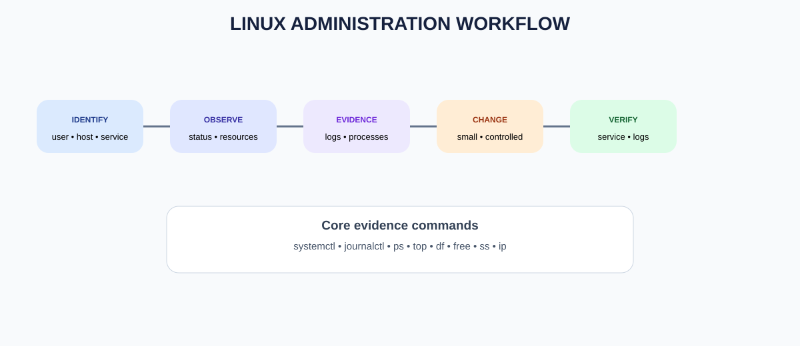

# DEVOPS FROM ZERO TO PRODUCTION
## PART 1 — DEVOPS & LINUX FOUNDATION
# DAY 2 — LINUX ADMINISTRATION

**Foundation of Mastering Automation (FOMA)**  
**William Foma — DevOps Trainer**  
**https://foma.life**

> **Course principle:** A DevOps engineer does not merely know commands. They understand the system, change it safely, verify the result, and know how to recover when something fails.

---

## 1. Day 2 Mission

Day 1 taught you to navigate Linux and manipulate files. Day 2 moves from **using Linux** to **administering Linux**.

By the end of this lesson you should be able to:

- explain how Linux boots and runs services;
- inspect system health;
- manage users and groups safely;
- understand ownership and permissions in operational scenarios;
- manage services with systemd;
- inspect logs with journalctl;
- work with processes and signals;
- understand SSH at a practical level;
- manage packages on Ubuntu/Debian;
- inspect disks, memory and CPU;
- perform basic operational troubleshooting;
- make changes safely and verify them.

---

## 2. What Is Linux Administration?

Linux administration is the discipline of keeping a Linux system **available, secure, configured, observable and useful**.

A Linux administrator or DevOps engineer commonly works with:

**Users → Permissions → Processes → Services → Packages → Storage → Logs → Network → Security**

### Real-world example

A web application is unavailable.

A professional response is not:

> "I will restart everything."

It is:

1. identify the server;
2. identify the application/service;
3. inspect service state;
4. inspect logs;
5. check CPU/memory/disk;
6. identify the failure;
7. make the smallest safe change;
8. verify recovery;
9. document what happened.

> 💡 **DEVOPS TIP:** Troubleshooting is evidence-driven. Observe first; change second.

---

## 3. Linux Administration Architecture



Think of a server as several layers:

| Layer | Questions |
|---|---|
| User | Who is accessing the system? |
| Files | Can the application read/write what it needs? |
| Process | Is the application process running? |
| Service | Is systemd managing it correctly? |
| Resources | Is CPU, memory or disk exhausted? |
| Logs | What does the system report? |
| Network | Can clients reach the service? |
| Package | Is the required software installed/current? |

---

## 4. Users, Groups and Privilege

Linux identifies every process and file operation through users and groups.

### Inspect your identity

```bash
$ whoami
will

$ id
uid=1000(will) gid=1000(will) groups=1000(will),27(sudo)
```

- **UID** = user identifier.
- **GID** = primary group identifier.
- Groups provide shared access.

### Create a user

On Ubuntu/Debian:

```bash
$ sudo adduser devopsuser
```

Follow the prompts.

Verify:

```bash
$ id devopsuser
$ getent passwd devopsuser
```

### Create a group

```bash
$ sudo groupadd devops
$ sudo usermod -aG devops devopsuser
```

Verify:

```bash
$ groups devopsuser
```

> ⚠️ **WARNING:** `usermod -G` without `-a` can replace supplementary groups. Use `-aG` when adding a group.

---

## 5. sudo and Least Privilege

`sudo` allows an authorized user to execute a command with elevated privileges.

```bash
$ sudo apt update
```

Use sudo for the specific operation that needs it, not for everything.

### Why?

Running an interactive shell as root increases the blast radius of mistakes.

> 🎯 **INTERVIEW TIP:** Least privilege means giving an identity only the permissions required to perform its job.

---

## 6. File Ownership and Permissions

Inspect:

```bash
$ ls -l /var/www/
```

Example:

```
drwxr-xr-x 2 root www-data 4096 Oct 5 app
```

Interpretation:

- owner: `root`
- group: `www-data`
- owner permissions: `rwx`
- group permissions: `r-x`
- others: `r-x`

Change ownership:

```bash
$ sudo chown -R www-data:www-data /var/www/app
```

Change permissions:

```bash
$ sudo chmod 755 /var/www/app
```

Use recursive permissions carefully.

> ⚠️ **WARNING:** Never "fix" a permission problem by blindly running `chmod -R 777`. Diagnose which identity needs which permission.

---

## 7. Processes and Signals

A process is a running instance of a program.

List processes:

```bash
$ ps aux
```

Find nginx:

```bash
$ ps aux | grep '[n]ginx'
```

Interactive monitoring:

```bash
$ top
```

If installed:

```bash
$ htop
```

Every process has a **PID**.

Graceful termination:

```bash
$ kill 1234
```

Forceful termination:

```bash
$ kill -9 1234
```

`SIGTERM` asks the application to terminate cleanly. `SIGKILL` stops it immediately and cannot be caught by the process.

> ⚠️ **WARNING:** Confirm the PID before killing a process.

---

## 8. Services and systemd

Modern Ubuntu systems commonly use **systemd** as the service manager.

Check a service:

```bash
$ systemctl status nginx
```

Start:

```bash
$ sudo systemctl start nginx
```

Stop:

```bash
$ sudo systemctl stop nginx
```

Restart:

```bash
$ sudo systemctl restart nginx
```

Reload configuration when supported:

```bash
$ sudo systemctl reload nginx
```

Enable at boot:

```bash
$ sudo systemctl enable nginx
```

Disable at boot:

```bash
$ sudo systemctl disable nginx
```

Check whether it is enabled:

```bash
$ systemctl is-enabled nginx
```

> 🧠 **REMEMBER:** `restart` affects the running service. `enable` controls whether the service is started during boot. They are different operations.

---

## 9. Logs with journalctl

Systemd services commonly write logs to the system journal.

```bash
$ sudo journalctl -u nginx
```

Recent entries:

```bash
$ sudo journalctl -u nginx -n 50
```

Follow new entries:

```bash
$ sudo journalctl -u nginx -f
```

Logs since today:

```bash
$ sudo journalctl -u nginx --since today
```

> 🔧 **HANDS-ON:** Stop nginx, inspect its state, start it again, then inspect the journal. Observe the difference between service state and log evidence.

---

## 10. Storage Administration

Check filesystem capacity:

```bash
$ df -h
```

Check directory/file sizes:

```bash
$ du -sh /var/log
$ du -sh /var/log/*
```

List block devices:

```bash
$ lsblk
```

### Why this matters

A server can appear healthy but fail because a filesystem is 100% full.

Typical chain:

**Application fails → writes logs → disk fills → writes fail → application becomes unhealthy**

> 🚀 **REAL-WORLD SCENARIO:** Before restarting an application that suddenly fails, check `df -h`.

---

## 11. CPU and Memory

Memory:

```bash
$ free -h
```

CPU/load/process view:

```bash
$ uptime
$ top
```

Look for:

- high CPU;
- exhausted memory;
- swap pressure;
- runaway processes;
- unusual load.

Do not immediately kill the largest process. First identify what it is and why it is consuming resources.

---

## 12. Package Administration with APT

Update package metadata:

```bash
$ sudo apt update
```

Install:

```bash
$ sudo apt install nginx
```

Remove:

```bash
$ sudo apt remove nginx
```

Upgrade installed packages:

```bash
$ sudo apt upgrade
```

### Critical distinction

**apt update** downloads current package metadata.

**apt upgrade** installs newer versions of installed packages.

> 🎯 **INTERVIEW TIP:** `apt update` does not itself upgrade installed packages.

---

## 13. SSH Fundamentals

SSH provides encrypted remote access.

Typical command:

```bash
$ ssh user@server-ip
```

Example:

```bash
$ ssh ubuntu@192.0.2.10
```

Once connected:

```bash
$ whoami
$ hostname
$ uptime
```

A production SSH setup normally uses:

- key-based authentication;
- restricted accounts;
- least privilege;
- controlled network access;
- logging and monitoring.

Do not expose administrative access broadly without a security design.

---

## 14. Basic Network Diagnostics

Check interfaces:

```bash
$ ip addr
```

Routes:

```bash
$ ip route
```

Test reachability:

```bash
$ ping -c 4 8.8.8.8
```

Check DNS:

```bash
$ getent hosts example.com
```

Check listening sockets:

```bash
$ ss -tulpn
```

> 🧠 **REMEMBER:** "The application is down" can mean application failure, process failure, service failure, resource exhaustion, network failure or DNS failure. Separate the layers.

---

## 15. Safe Administration Workflow


Use this sequence:

```
REPORT
  ↓
IDENTIFY
  ↓
OBSERVE
  ↓
COLLECT EVIDENCE
  ↓
FORM HYPOTHESIS
  ↓
MAKE SMALLEST SAFE CHANGE
  ↓
VERIFY
  ↓
DOCUMENT
```

Example:

```bash
$ systemctl status nginx
$ journalctl -u nginx -n 50
$ df -h
$ free -h
$ ss -tulpn
```

Only after evidence should you decide whether to restart, reconfigure, free disk space, fix permissions, or escalate.

---

## 16. Hands-On Lab — Administer a Web Server

### Objective

Install nginx, inspect it, manage it, examine logs and verify its process.

### Step 1 — Update package metadata

```bash
$ sudo apt update
```

### Step 2 — Install nginx

```bash
$ sudo apt install nginx
```

### Step 3 — Verify

```bash
$ nginx -v
$ systemctl status nginx
```

### Step 4 — Inspect the process

```bash
$ ps aux | grep '[n]ginx'
```

### Step 5 — Inspect listening ports

```bash
$ ss -tulpn | grep ':80'
```

### Step 6 — Inspect logs

```bash
$ sudo journalctl -u nginx -n 30
```

### Step 7 — Stop and verify

```bash
$ sudo systemctl stop nginx
$ systemctl is-active nginx
```

Expected:

```
inactive
```

### Step 8 — Start and verify

```bash
$ sudo systemctl start nginx
$ systemctl is-active nginx
```

Expected:

```
active
```

---

## 17. Troubleshooting Challenge

### Scenario

The web server is reported as unavailable.

Without immediately restarting it, investigate:

```bash
systemctl status nginx
journalctl -u nginx -n 50
ps aux | grep '[n]ginx'
ss -tulpn | grep ':80'
df -h
free -h
```

### Questions

1. Is nginx running?
2. What PID belongs to nginx?
3. Is port 80 listening?
4. Are there recent service errors?
5. Is disk capacity sufficient?
6. Is memory exhausted?
7. What evidence supports your conclusion?

### Answer key

There is no single correct diagnosis. The professional answer must be based on the evidence collected. A healthy result should show an active service, nginx processes, a listening HTTP socket and no resource exhaustion that explains the outage.

---

## 18. Day 2 Practice Challenge

Create an operational report containing:

- hostname;
- current user;
- OS information;
- uptime;
- CPU/load observation;
- memory usage;
- filesystem usage;
- nginx service state;
- nginx PID;
- listening ports;
- last 20 nginx journal entries.

Useful commands:

```bash
whoami
hostname
cat /etc/os-release
uptime
free -h
df -h
systemctl status nginx
ps aux | grep '[n]ginx'
ss -tulpn
sudo journalctl -u nginx -n 20
```

---

## 19. Knowledge Check

1. What is the purpose of systemd?
2. What does `systemctl status` show?
3. What is a PID?
4. What is the difference between SIGTERM and SIGKILL?
5. What does `journalctl -u nginx` do?
6. What does `df -h` measure?
7. What does `free -h` show?
8. What does `apt update` do?
9. What does `apt upgrade` do?
10. What is SSH?
11. Why is least privilege important?
12. Why is `chmod -R 777` dangerous?
13. What command displays routes?
14. What command displays listening sockets?
15. Why should you collect evidence before restarting a service?

### Answer Key

1. Service/system manager and init framework.
2. Current service state and recent status information.
3. Process identifier.
4. SIGTERM requests graceful termination; SIGKILL immediately terminates.
5. Shows journal entries for the nginx unit.
6. Filesystem space usage.
7. Memory and swap information.
8. Refreshes package metadata.
9. Installs available upgrades.
10. Secure remote shell protocol.
11. It reduces unnecessary privilege and blast radius.
12. It can expose or alter large amounts of data and weaken security.
13. `ip route`.
14. `ss -tulpn`.
15. Restarting can hide evidence and does not necessarily fix the root cause.

---

## 20. Day 2 Command Cheat Sheet

| Command | Purpose | Example |
|---|---|---|
| whoami | Current user | `whoami` |
| id | UID/GID/groups | `id` |
| groups | Group membership | `groups` |
| systemctl | Manage services | `systemctl status nginx` |
| journalctl | Read systemd logs | `journalctl -u nginx` |
| ps | Process listing | `ps aux` |
| top | Live processes/resources | `top` |
| kill | Send signal | `kill 1234` |
| df | Filesystem usage | `df -h` |
| du | Directory usage | `du -sh /var/log` |
| free | Memory | `free -h` |
| lsblk | Block devices | `lsblk` |
| ip | Network configuration | `ip addr` |
| ss | Sockets/ports | `ss -tulpn` |
| ssh | Remote shell | `ssh user@host` |
| apt | Package management | `sudo apt install nginx` |

---

## 21. Day 2 Final Checklist

- [ ] I understand Linux administration.
- [ ] I can identify users and groups.
- [ ] I understand sudo and least privilege.
- [ ] I can inspect permissions and ownership.
- [ ] I can inspect and manage processes.
- [ ] I understand systemd services.
- [ ] I can read service logs.
- [ ] I can inspect CPU, memory and disk.
- [ ] I understand APT.
- [ ] I understand basic SSH.
- [ ] I can perform first-response troubleshooting.

---

# DAY 2 COMPLETE

You have moved from **Linux user** to **Linux operator**.

Next:

## DAY 3 — GIT & GITHUB

**FOUNDATION OF MASTERING AUTOMATION**  
**Learn • Automate • Innovate • Elevate**

**William Foma — DevOps Trainer**  
**https://foma.life**
