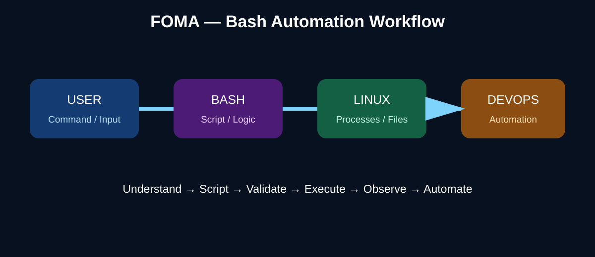

# DEVOPS FROM ZERO TO PRODUCTION
## PART 1 — DEVOPS & LINUX FOUNDATION
# DAY 3 — BASH & SHELL AUTOMATION

**Foundation of Mastering Automation (FOMA)**  
**William Foma — DevOps Trainer**  
**https://foma.life**

> **Course principle:** Automation starts with understanding what the shell does, then turning repeatable commands into safe, observable and reusable scripts.

## 1. Day 3 Mission

Day 2 taught you to administer a Linux system. Day 3 turns those administration skills into **automation**.

By the end of this lesson you should be able to:

- explain what a shell is and how Bash executes commands;
- create and execute Bash scripts;
- use variables and environment variables;
- accept user input and script arguments;
- use pipes and redirection;
- understand exit codes;
- build conditions, loops and functions;
- validate input and fail safely;
- debug scripts with `bash -n` and `bash -x`;
- automate operational checks and log analysis;
- build a small production-style system health-check script.



## 2. What Is a Shell?

A **shell** is a command-line interpreter. It receives commands, interprets them and asks the operating system to execute them.

Bash means **Bourne Again SHell** and is one of the most common shells on Linux.

A typical flow is:

```text
USER
  ↓
BASH SHELL
  ↓
COMMAND / SCRIPT
  ↓
LINUX KERNEL
  ↓
PROCESS / FILE / NETWORK / SERVICE
```

Check your shell:

```bash
echo "$SHELL"
ps -p $$ -o pid,comm,args
```

## 3. How a Bash Script Works

A script is a text file containing commands.

### Step 1 — Create

```bash
nano hello.sh
```

Content:

```bash
#!/usr/bin/env bash

echo "Hello from FOMA"
```

### Step 2 — Syntax check

```bash
bash -n hello.sh
```

### Step 3 — Make executable

```bash
chmod +x hello.sh
```

### Step 4 — Run

```bash
./hello.sh
```

You can also execute it explicitly with Bash:

```bash
bash hello.sh
```

> **Important:** `chmod +x` changes the file mode; it does not change the script's contents.

## 4. Variables

Variables store values.

```bash
#!/usr/bin/env bash

name="FOMA"
echo "Hello, $name"
```

Use quotes when a value may contain spaces:

```bash
project="DevOps From Zero to Production"
echo "$project"
```

Inspect a variable:

```bash
printf '%s\n' "$project"
```

> **Common mistake:** `name = "FOMA"` is invalid Bash syntax because assignments cannot contain spaces around `=`.

## 5. Environment Variables

Environment variables are inherited by child processes.

```bash
echo "$HOME"
echo "$PATH"
echo "$USER"
echo "$SHELL"
echo "$PWD"
```

Create one:

```bash
export PROJECT="foma"
echo "$PROJECT"
```

A child process can read exported variables.

> **DevOps connection:** CI/CD runners, containers and deployment tools commonly receive configuration through environment variables. Never place secrets directly in source code.

## 6. Input and Script Arguments

### Read interactive input

```bash
read -r -p "Enter your name: " name
echo "Hello, $name"
```

### Positional arguments

For:

```bash
./deploy.sh production v1.4.0
```

Bash provides:

| Variable | Meaning |
|---|---|
| `$0` | Script name |
| `$1` | First argument |
| `$2` | Second argument |
| `$#` | Number of arguments |
| `$@` | All arguments |

Example:

```bash
#!/usr/bin/env bash

echo "Script: $0"
echo "Environment: $1"
echo "Version: $2"
echo "Argument count: $#"
```

## 7. Pipes and Redirection

Pipes send the output of one command into another command.

```bash
ps aux | grep '[n]ginx'
```

Count lines:

```bash
cat app.log | wc -l
```

Filter errors:

```bash
grep -i "error" app.log
```

### Redirection

Overwrite:

```bash
echo "first line" > output.txt
```

Append:

```bash
echo "second line" >> output.txt
```

Redirect standard error:

```bash
command 2> errors.log
```

Redirect both output streams:

```bash
command > output.log 2>&1
```

Prefer this readable form in modern Bash:

```bash
command &> output.log
```

## 8. Conditions

Conditions control decision-making.

```bash
#!/usr/bin/env bash

age=20

if [[ "$age" -ge 18 ]]; then
  echo "Adult"
else
  echo "Minor"
fi
```

Common tests:

| Operator | Meaning |
|---|---|
| `-eq` | equal |
| `-ne` | not equal |
| `-gt` | greater than |
| `-ge` | greater/equal |
| `-lt` | less than |
| `-le` | less/equal |
| `-f` | regular file exists |
| `-d` | directory exists |

## 9. Loops

### For loop

```bash
for server in web01 web02 web03; do
  echo "Checking $server"
done
```

### While loop

```bash
count=1

while [[ "$count" -le 3 ]]; do
  echo "Attempt $count"
  ((count++))
done
```

> **Production use:** loops are useful for repeated health checks, processing files, validating hosts and automating routine administration.

## 10. Functions

Functions group reusable logic.

```bash
greet() {
  local name="$1"
  echo "Hello, $name"
}

greet "FOMA"
```

Use `local` for function-scoped variables.

A useful function structure is:

```bash
check_service() {
  local service="$1"

  if systemctl is-active --quiet "$service"; then
    echo "$service: OK"
    return 0
  fi

  echo "$service: FAILED"
  return 1
}
```

## 11. Exit Codes

Linux commands return an exit status.

- `0` = success
- non-zero = failure

Inspect the previous command:

```bash
ls /etc/passwd
echo "$?"
```

Example:

```bash
if systemctl is-active --quiet nginx; then
  echo "nginx is running"
else
  echo "nginx is not running"
fi
```

Set your own status:

```bash
exit 1
```

> **CI/CD connection:** Pipelines use exit codes to decide whether a stage succeeds or fails.

## 12. Safer Bash Scripts

For automation that should fail predictably:

```bash
#!/usr/bin/env bash
set -euo pipefail
```

Meaning:

- `-e` — stop when a command fails;
- `-u` — treat unset variables as errors;
- `pipefail` — make a pipeline fail if a command inside it fails.

Use deliberate error handling when failure is expected.

```bash
if ! systemctl is-active --quiet nginx; then
  echo "nginx is not running"
fi
```

Do not add strict mode mechanically without understanding the script.

## 13. Debugging Bash

Syntax check:

```bash
bash -n script.sh
```

Trace execution:

```bash
bash -x script.sh
```

Print selected variables:

```bash
printf 'Environment=%s Version=%s\n' "$ENVIRONMENT" "$VERSION"
```

A good debugging sequence is:

```text
REPRODUCE
  ↓
READ THE ERROR
  ↓
CHECK EXIT STATUS
  ↓
TRACE THE SCRIPT
  ↓
ISOLATE THE FAILURE
  ↓
FIX
  ↓
RE-RUN
```

## 14. Mini Project — System Health Check

Create `system-health.sh`:

```bash
#!/usr/bin/env bash
set -euo pipefail

REPORT="health-report.txt"

{
  echo "===== FOMA SYSTEM HEALTH CHECK ====="
  date
  echo

  echo "Hostname:"
  hostname
  echo

  echo "Uptime:"
  uptime
  echo

  echo "Memory:"
  free -h
  echo

  echo "Disk:"
  df -h
  echo

  echo "Top CPU processes:"
  ps aux --sort=-%cpu | head -n 6
  echo

  echo "Nginx:"
  if systemctl is-active --quiet nginx; then
    echo "nginx: RUNNING"
  else
    echo "nginx: NOT RUNNING"
  fi
} > "$REPORT"

echo "Report written to $REPORT"
```

Run:

```bash
chmod +x system-health.sh
./system-health.sh
cat health-report.txt
```

## 15. Log Analysis Automation

A simple error counter:

```bash
#!/usr/bin/env bash
set -euo pipefail

LOG_FILE="${1:-app.log}"

if [[ ! -f "$LOG_FILE" ]]; then
  echo "Log file not found: $LOG_FILE" >&2
  exit 1
fi

echo "Analyzing: $LOG_FILE"
echo "Total lines: $(wc -l < "$LOG_FILE")"
echo "Errors: $(grep -ic "error" "$LOG_FILE" || true)"
echo "Warnings: $(grep -ic "warn" "$LOG_FILE" || true)"
```

Run:

```bash
./analyze-log.sh app.log
```

## 16. DevOps Applications

Bash is commonly used to:

- prepare build agents;
- validate deployments;
- check service health;
- rotate or inspect logs;
- automate repetitive Linux administration;
- prepare CI/CD environments;
- test prerequisites before Terraform/Kubernetes work;
- glue multiple CLI tools together;
- generate operational reports.

Bash should not become an unmaintainable replacement for every application. Use it where shell automation is the simplest reliable solution.

## 17. Hands-On Practice

1. Create `system-info.sh`.
2. Add the date and hostname.
3. Display disk usage with `df -h`.
4. Display memory with `free -h`.
5. Show the top five CPU processes.
6. Check whether nginx is running.
7. Save all output to `report.txt`.
8. Add a function called `check_service`.
9. Accept the service name as an argument.
10. Exit with status `0` when the service is healthy and `1` otherwise.

## 18. Troubleshooting Challenge

A script fails in CI with:

```text
unbound variable
```

Investigate:

```bash
bash -n script.sh
bash -x script.sh
```

Look for variables referenced before assignment, especially when `set -u` is enabled.

Another common failure:

```text
Permission denied
```

Check:

```bash
ls -l script.sh
chmod +x script.sh
```

If a command works manually but fails in automation, compare:

- current user;
- working directory;
- PATH;
- environment variables;
- file permissions;
- shell interpreter.

## 19. Knowledge Check

1. What is a shell?
2. What does Bash stand for?
3. What does the shebang specify?
4. How do you make a script executable?
5. What does `$1` represent?
6. What does `$#` represent?
7. What is an environment variable?
8. What does `|` do?
9. What is the difference between `>` and `>>`?
10. What does `$?` contain?
11. What does exit code `0` normally mean?
12. Why are functions useful?
13. What does `bash -n` do?
14. What does `bash -x` do?
15. What does `set -euo pipefail` help with?
16. Why should scripts validate their inputs?
17. How can a script check whether nginx is running?
18. Why are exit codes important in CI/CD?
19. What is the difference between a shell command and a Bash script?
20. Give one real DevOps use case for Bash.

### Answer Key

1. A command-line interpreter.
2. Bourne Again SHell.
3. It identifies the interpreter used to execute the script.
4. `chmod +x script.sh`.
5. The first positional argument.
6. The number of positional arguments.
7. A variable exported to child processes.
8. Pipes stdout from one command into another command's stdin.
9. `>` overwrites; `>>` appends.
10. The previous command's exit status.
11. Success.
12. They make repeated logic reusable and easier to maintain.
13. Syntax-checks a script without executing it.
14. Traces commands as Bash executes them.
15. Predictable failure handling and detection of unset variables/pipeline failures.
16. To prevent incorrect or unsafe operations.
17. `systemctl is-active --quiet nginx`.
18. CI/CD stages use them to determine success or failure.
19. A script is a reusable file containing one or more commands and logic.
20. Health checks, deployment validation, log analysis, server preparation or CI automation.

## 20. Command Cheat Sheet

| Task | Command |
|---|---|
| Run script | `./script.sh` |
| Run with Bash | `bash script.sh` |
| Syntax check | `bash -n script.sh` |
| Debug | `bash -x script.sh` |
| Make executable | `chmod +x script.sh` |
| Read input | `read -r variable` |
| Print value | `echo "$variable"` |
| Pipe | `cmd1 | cmd2` |
| Overwrite | `cmd > file` |
| Append | `cmd >> file` |
| Redirect stderr | `cmd 2> errors.log` |
| Previous exit code | `echo "$?"` |
| Export variable | `export NAME=value` |
| Function | `name() { ...; }` |

## 21. Day 3 Completion Checklist

- [ ] I can explain Bash and the shell.
- [ ] I can create and execute a script.
- [ ] I understand variables and environment variables.
- [ ] I can use arguments and input.
- [ ] I can use pipes and redirection.
- [ ] I can write conditions and loops.
- [ ] I can create functions.
- [ ] I understand exit codes.
- [ ] I can debug a Bash script.
- [ ] I can automate a Linux health check.

> **FOMA STANDARD:** Do not automate a task you cannot explain manually. Understand first. Automate second.

**Next:** Day 4 — Git Fundamentals
