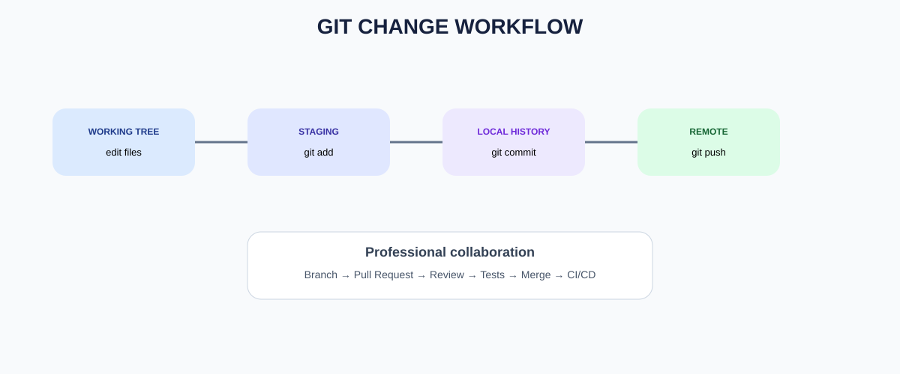

# DEVOPS FROM ZERO TO PRODUCTION
## PART 1 — DEVOPS & LINUX FOUNDATION
# DAY 3 — GIT & GITHUB

**Foundation of Mastering Automation (FOMA)**  
**William Foma — DevOps Trainer**  
**https://foma.life**

---

## 1. Day 3 Mission

Git is the version-control foundation of modern DevOps. Today you move from managing files manually to managing **changes as traceable, reviewable, recoverable history**.

By the end of Day 3 you should be able to:

- explain version control;
- explain Git and GitHub;
- understand repositories, commits and branches;
- configure Git identity;
- create and clone repositories;
- stage and commit changes;
- inspect history and differences;
- create and merge branches;
- resolve a basic merge conflict;
- use a remote repository;
- push and pull safely;
- understand pull requests;
- connect Git to CI/CD.

---

## 2. Why Version Control?

Without version control, teams often create:

```
app-final.zip
app-final-v2.zip
app-final-v2-real.zip
app-final-v2-real-final.zip
```

Git replaces this with a structured history.

```
Working Directory
      ↓
    Staging
      ↓
     Commit
      ↓
Remote Repository
```

A commit answers:

- what changed?
- who changed it?
- when?
- why?
- from which previous state?

> 💡 **DEVOPS TIP:** Git is not only backup. It is a mechanism for controlled change.

---

## 3. Git vs GitHub

**Git** is the distributed version-control system.

**GitHub** is a platform that hosts Git repositories and adds collaboration capabilities such as pull requests, issues, reviews, permissions and automation.

Other Git hosting platforms include GitLab and Bitbucket.

Do not confuse the Git client with the hosting platform.

---

## 4. Git Mental Model



Think in four locations:

1. **Working tree** — files you are editing.
2. **Staging area** — changes selected for the next commit.
3. **Local repository** — committed history on your machine.
4. **Remote repository** — shared repository such as GitHub.

Typical flow:

```bash
edit
  ↓
git status
  ↓
git add
  ↓
git commit
  ↓
git push
```

---

## 5. Install and Configure Git

Ubuntu/Debian:

```bash
$ sudo apt update
$ sudo apt install git
```

Verify:

```bash
$ git --version
```

Configure identity:

```bash
$ git config --global user.name "William Foma"
$ git config --global user.email "your-email@example.com"
```

Inspect:

```bash
$ git config --global --list
```

> ⚠️ Use an email appropriate for your Git hosting/account configuration.

---

## 6. Create Your First Repository

```bash
$ mkdir devops-git-lab
$ cd devops-git-lab
$ git init
```

Expected:

```
Initialized empty Git repository...
```

Check:

```bash
$ git status
```

Create a file:

```bash
$ echo "# DevOps Git Lab" > README.md
$ git status
```

Git should show the file as untracked.

---

## 7. Staging and Commit

Stage:

```bash
$ git add README.md
```

Check:

```bash
$ git status
```

Commit:

```bash
$ git commit -m "docs: add initial README"
```

Inspect:

```bash
$ git log --oneline
```

A good commit message describes the change.

Good:

```
feat: add health check endpoint
fix: handle missing configuration
docs: add deployment instructions
```

Poor:

```
update
stuff
changes
final
```

> 🎯 **INTERVIEW TIP:** A commit is a snapshot in Git history; staging determines what goes into that snapshot.

---

## 8. git diff

Modify:

```bash
$ echo "Learning DevOps with FOMA" >> README.md
```

Inspect:

```bash
$ git diff
```

Stage:

```bash
$ git add README.md
```

Inspect staged changes:

```bash
$ git diff --staged
```

Commit:

```bash
$ git commit -m "docs: expand README"
```

---

## 9. Git History

```bash
$ git log
```

Compact:

```bash
$ git log --oneline --decorate --graph --all
```

Inspect a commit:

```bash
$ git show <commit-id>
```

Git history is extremely valuable during production troubleshooting because you can correlate an incident with a configuration or code change.

---

## 10. Branches

A branch provides an independent line of development.

Create and switch:

```bash
$ git switch -c feature/healthcheck
```

List branches:

```bash
$ git branch
```

Switch back:

```bash
$ git switch main
```

Modern Git recommends `git switch` for branch switching.

> 🧠 **REMEMBER:** A branch is not a copy of an entire repository. Git stores commits and references that identify lines of history.

---

## 11. Merge

On your feature branch:

```bash
$ echo "Health check ready" > healthcheck.txt
$ git add healthcheck.txt
$ git commit -m "feat: add healthcheck"
```

Return to main:

```bash
$ git switch main
```

Merge:

```bash
$ git merge feature/healthcheck
```

Inspect:

```bash
$ git log --oneline --graph --all
```

---

## 12. Merge Conflicts

A conflict occurs when Git cannot automatically combine changes.

Typical flow:

```
CONFLICT (content): Merge conflict in README.md
```

Open the file. You may see:

```text
<<<<<<< HEAD
main version
=======
feature version
>>>>>>> feature/...
```

Resolve the content manually, remove the conflict markers, then:

```bash
$ git add README.md
$ git commit -m "merge: resolve README conflict"
```

> 🔧 **HANDS-ON:** Never delete conflict markers without understanding which content should remain.

---

## 13. Remote Repositories

Add a remote:

```bash
$ git remote add origin git@github.com:YOUR-USER/YOUR-REPO.git
```

Verify:

```bash
$ git remote -v
```

Push:

```bash
$ git push -u origin main
```

The exact authentication method depends on your GitHub setup.

Common options include SSH keys and HTTPS with appropriate credentials/token mechanisms.

---

## 14. Clone a Repository

Clone:

```bash
$ git clone https://github.com/OWNER/REPOSITORY.git
```

Enter:

```bash
$ cd REPOSITORY
```

Inspect:

```bash
$ git remote -v
$ git status
$ git branch -a
```

---

## 15. Pull vs Fetch

Fetch downloads remote history without integrating it into your current branch:

```bash
$ git fetch origin
```

Pull normally fetches and integrates remote changes:

```bash
$ git pull
```

Conceptually:

```
git fetch
    ↓
download remote information
    ↓
you inspect
```

while pull is a higher-level synchronization operation.

> 🎯 **INTERVIEW TIP:** Understand what your Git command changes locally before using it on an active branch.

---

## 16. GitHub Pull Requests

A common professional workflow:

```
main
 │
 ├── feature branch
 │       ↓
 │     commit
 │       ↓
 │     push
 │       ↓
 │   Pull Request
 │       ↓
 │   review + tests
 │       ↓
 └── merge
```

A pull request is more than a merge button. It provides:

- review;
- automated tests;
- discussion;
- traceability;
- approval;
- change visibility.

This becomes a key entry point into CI/CD.

---

## 17. .gitignore

Some files should not be committed.

Example:

```gitignore
.env
*.log
node_modules/
.terraform/
*.tfstate
__pycache__/
.DS_Store
```

Never commit secrets merely because the repository is private.

> ⚠️ **SECURITY WARNING:** If a password, API key or token is committed, deleting it from the latest file is not enough. It may remain in Git history and should be treated as exposed.

---

## 18. Real DevOps Workflow


Typical production flow:

```
Developer
   ↓
Local Git
   ↓
Feature Branch
   ↓
Pull Request
   ↓
Automated Tests
   ↓
Code Review
   ↓
Merge
   ↓
CI/CD Pipeline
   ↓
Artifact
   ↓
Deployment
```

Git becomes the source of truth for application and infrastructure code.

---

## 19. Hands-On Lab

### Build a small application repository

```bash
mkdir foma-git-lab
cd foma-git-lab
git init
git switch -c main
```

Create:

```bash
mkdir app docs
echo "FOMA DevOps Application" > app/index.html
echo "# FOMA Git Lab" > README.md
```

Stage and commit:

```bash
git add .
git commit -m "feat: initialize DevOps lab"
```

Create a feature:

```bash
git switch -c feature/documentation
echo "Git provides traceable change history." >> docs/git.md
git add docs/git.md
git commit -m "docs: explain Git value"
```

Merge:

```bash
git switch main
git merge feature/documentation
```

Inspect:

```bash
git log --oneline --graph --all
git status
```

---

## 20. Troubleshooting Exercise

### Scenario

A teammate says:

> "My changes disappeared."

Ask them to run:

```bash
git status
git branch
git log --oneline --all
git diff
git reflog
```

Explain what each command can reveal.

### Scenario 2

A push is rejected because the remote contains commits not present locally.

Do not immediately use destructive commands.

Investigate:

```bash
git fetch origin
git log --oneline --graph --all
git status
```

Then choose an appropriate integration strategy.

---

## 21. Day 3 Practice Challenge

Create a repository named:

```
devops-from-zero
```

Requirements:

1. Create `README.md`.
2. Make an initial commit.
3. Create `feature/linux-notes`.
4. Add Linux notes.
5. Commit.
6. Return to main.
7. Create another commit.
8. Merge the feature.
9. Inspect history.
10. Create a `.gitignore`.
11. Add a sample log and verify it is ignored.
12. Add a remote if you have a GitHub repository.
13. Push your main branch.

Submit:

```bash
git status
git log --oneline --graph --all
git branch
git remote -v
```

---

## 22. Knowledge Check

1. What problem does Git solve?
2. What is GitHub?
3. What is a repository?
4. What does `git init` do?
5. What is the staging area?
6. What does `git add` do?
7. What does `git commit` do?
8. What does `git diff` show?
9. What is a branch?
10. What does `git merge` do?
11. What causes a merge conflict?
12. What is a remote?
13. What does `git clone` do?
14. What is the difference between fetch and pull?
15. Why use a pull request?
16. Why use `.gitignore`?
17. Why are secrets dangerous in Git?
18. What does `git log --oneline --graph --all` help visualize?
19. Why are small focused commits useful?
20. How does Git connect to CI/CD?

### Answer Key

1. It tracks and manages changes.
2. A Git hosting/collaboration platform.
3. A directory containing Git-managed history and files.
4. Initializes a Git repository.
5. The selected changes for the next commit.
6. Moves changes into staging.
7. Records a snapshot in history.
8. Uncommitted changes.
9. A reference to a line of commits.
10. Integrates histories.
11. Git cannot automatically reconcile conflicting changes.
12. A named reference to another repository.
13. Downloads a repository and its history.
14. Fetch downloads remote updates; pull fetches and integrates.
15. Review, tests, discussion and controlled merging.
16. To exclude generated, local or sensitive files.
17. They can remain in history.
18. Repository history and branch relationships.
19. Easier review, rollback and diagnosis.
20. Commits/merges can trigger automated build/test/deploy workflows.

---

## 23. Git Cheat Sheet

| Command | Purpose |
|---|---|
| `git init` | Initialize repository |
| `git clone` | Copy remote repository |
| `git status` | Show working state |
| `git add` | Stage changes |
| `git commit` | Create snapshot |
| `git log` | View history |
| `git diff` | Compare changes |
| `git branch` | List/manage branches |
| `git switch` | Change branch |
| `git merge` | Merge branch |
| `git fetch` | Download remote history |
| `git pull` | Fetch + integrate |
| `git push` | Upload commits |
| `git remote -v` | Show remotes |
| `git show` | Inspect commit |
| `git reflog` | Inspect local reference movements |

---

## 24. Day 3 Final Checklist

- [ ] I understand version control.
- [ ] I understand Git vs GitHub.
- [ ] I can create a repository.
- [ ] I can stage and commit.
- [ ] I can inspect history.
- [ ] I can create branches.
- [ ] I can merge branches.
- [ ] I understand merge conflicts.
- [ ] I can clone and push.
- [ ] I understand fetch vs pull.
- [ ] I understand pull requests.
- [ ] I know why secrets must not be committed.
- [ ] I can explain how Git feeds CI/CD.

# DAY 3 COMPLETE

Next:

## DAY 4 — BASH SCRIPTING & AUTOMATION

**FOUNDATION OF MASTERING AUTOMATION**  
**Learn • Automate • Innovate • Elevate**

**William Foma — DevOps Trainer**  
**https://foma.life**
