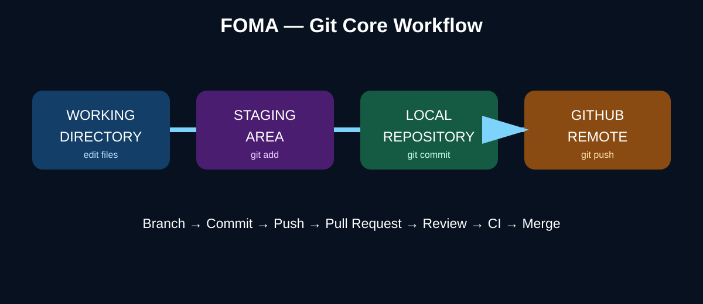

# DEVOPS FROM ZERO TO PRODUCTION
## PART 1 — DEVOPS & LINUX FOUNDATION
# DAY 4 — GIT FUNDAMENTALS

**Foundation of Mastering Automation (FOMA)**  
**William Foma — DevOps Trainer**  
**https://foma.life**

> **Course principle:** Version control is the safety net of modern engineering. Every change should be traceable, reviewable and recoverable.

## 1. Day 4 Mission

Day 4 introduces Git, the foundation of modern source control and a critical component of DevOps and CI/CD.

By the end of this lesson you should be able to:

- explain Git and distributed version control;
- understand the working tree, staging area and repository;
- initialize and clone repositories;
- create meaningful commits;
- inspect history and differences;
- create and switch branches;
- merge branches;
- resolve basic merge conflicts;
- work with remotes and GitHub;
- understand pull/fetch/push;
- use `.gitignore`;
- avoid committing secrets;
- connect Git workflows to CI/CD.



## 2. What Is Git?

Git is a **distributed version control system**.

It records changes to files so engineers can:

- track history;
- collaborate;
- create isolated branches;
- review changes;
- recover previous states;
- connect source code to automated pipelines.

Git is installed locally. GitHub is a hosted collaboration platform that can store Git repositories and provide pull requests, issues, Actions and other workflows.

> **Remember:** Git and GitHub are not the same thing.

## 3. The Git Mental Model

The basic workflow is:

```text
WORKING DIRECTORY
      ↓ git add
STAGING AREA
      ↓ git commit
LOCAL REPOSITORY
      ↓ git push
REMOTE REPOSITORY (GitHub)
```

The three local areas are essential:

| Area | Purpose |
|---|---|
| Working directory | Files you are editing |
| Staging area | Changes selected for the next commit |
| Repository | Committed project history |

## 4. Initialize a Repository

Create a project:

```bash
mkdir foma-git-lab
cd foma-git-lab
```

Initialize:

```bash
git init
```

Check:

```bash
git status
```

Configure identity if needed:

```bash
git config --global user.name "William Foma"
git config --global user.email "your-email@example.com"
```

Verify:

```bash
git config --global --list
```

## 5. Make Your First Commit

Create a file:

```bash
echo "# FOMA Git Lab" > README.md
```

Inspect:

```bash
git status
git diff
```

Stage:

```bash
git add README.md
```

Commit:

```bash
git commit -m "Initial commit"
```

Verify:

```bash
git log --oneline
```

> **Professional habit:** A commit message should describe the change, not the emotion. Prefer `Add health-check script` over `stuff`.

## 6. Inspect Changes

Working-tree differences:

```bash
git diff
```

Staged differences:

```bash
git diff --staged
```

History:

```bash
git log
git log --oneline
```

Show one commit:

```bash
git show <commit-hash>
```

This gives you an audit trail of how the project evolved.

## 7. Branches

Branches let you develop changes independently.

Create a branch:

```bash
git switch -c feature/hello
```

List branches:

```bash
git branch
```

Switch branches:

```bash
git switch main
```

Modern Git prefers `git switch` for branch navigation.

Older syntax you may still encounter:

```bash
git checkout main
```

## 8. Work on a Feature

On your feature branch:

```bash
echo "Hello from the feature branch" >> README.md
git add README.md
git commit -m "Add feature greeting"
```

View history:

```bash
git log --oneline --decorate --graph --all
```

The feature branch can now be reviewed before it is integrated into `main`.

## 9. Merge Changes

Switch to main:

```bash
git switch main
```

Merge:

```bash
git merge feature/hello
```

Verify:

```bash
git log --oneline --graph --all
```

Delete the merged local branch when appropriate:

```bash
git branch -d feature/hello
```

## 10. Merge Conflicts

A conflict happens when Git cannot safely combine competing changes.

Check:

```bash
git status
```

A conflicted file may contain:

```text
<<<<<<< HEAD
version from main
=======
version from feature
>>>>>>> feature/hello
```

Resolve the file by choosing or combining the correct content.

Then:

```bash
git add <resolved-file>
git commit
```

> **Important:** Do not blindly choose one side. Understand the intended behavior before resolving a conflict.

## 11. Remote Repositories and GitHub

Add a remote:

```bash
git remote add origin https://github.com/USERNAME/REPOSITORY.git
```

Verify:

```bash
git remote -v
```

Push the current branch:

```bash
git push -u origin main
```

After the upstream relationship exists:

```bash
git push
```

## 12. Clone, Fetch and Pull

Clone a repository:

```bash
git clone https://github.com/USERNAME/REPOSITORY.git
```

Fetch remote information without changing your working branch:

```bash
git fetch
```

Pull and integrate remote changes:

```bash
git pull
```

Conceptually:

```text
git fetch  → download remote information
git pull   → fetch + integrate changes
git push   → upload local commits
```

## 13. Pull Requests

A Pull Request (PR) is a collaboration and review mechanism commonly used on GitHub.

Typical workflow:

```text
ISSUE / TASK
    ↓
FEATURE BRANCH
    ↓
COMMITS
    ↓
PUSH
    ↓
PULL REQUEST
    ↓
REVIEW
    ↓
CI CHECKS
    ↓
MERGE
    ↓
DEPLOYMENT
```

A good PR should explain:

- what changed;
- why it changed;
- how it was tested;
- known risks;
- any deployment considerations.

## 14. .gitignore

Use `.gitignore` to exclude files that should not be versioned.

Example:

```gitignore
.env
*.log
node_modules/
__pycache__/
*.pyc
.DS_Store
Thumbs.db
```

Do not use `.gitignore` as a security strategy for secrets that were already committed. Once a secret enters Git history, treat it as exposed and rotate it.

## 15. Git and Secrets

Never commit:

- cloud access keys;
- passwords;
- private keys;
- API tokens;
- production credentials;
- database passwords.

Before committing:

```bash
git status
git diff --staged
```

If a secret is accidentally committed:

1. revoke/rotate it immediately;
2. investigate where it was exposed;
3. remove it from the repository/history using an appropriate history-rewrite procedure;
4. add preventive secret scanning.

> **DevSecOps connection:** Source control is part of the security boundary.

## 16. Common Git Commands

| Command | Purpose |
|---|---|
| `git status` | Show current state |
| `git add` | Stage changes |
| `git commit` | Save staged changes |
| `git log` | View history |
| `git diff` | View unstaged changes |
| `git diff --staged` | View staged changes |
| `git branch` | List/create branch information |
| `git switch` | Change branches |
| `git merge` | Combine branches |
| `git clone` | Copy a remote repository |
| `git fetch` | Download remote references |
| `git pull` | Fetch and integrate |
| `git push` | Upload commits |
| `git remote -v` | Show remotes |
| `git show` | Inspect a commit |

## 17. Safe Recovery Concepts

Git provides several different recovery mechanisms.

### Revert

Creates a new commit that reverses an earlier commit:

```bash
git revert <commit>
```

This is usually appropriate for changes that have already been shared.

### Reset

Moves the current branch reference and can change staging/working state depending on the mode.

```bash
git reset --soft HEAD~1
git reset --mixed HEAD~1
```

Use destructive reset modes carefully, especially on shared branches.

### Stash

Temporarily stores uncommitted changes:

```bash
git stash
git switch main
git stash pop
```

> **Rule:** Understand the difference between revert and reset before using either in production repositories.

## 18. Hands-On Lab — FOMA Git Workflow

Create:

```bash
mkdir foma-git-lab
cd foma-git-lab
git init
```

Create three files:

```bash
printf '# FOMA Git Lab\n' > README.md
printf 'print("Hello FOMA")\n' > app.py
printf '.env\n*.log\n' > .gitignore
```

Stage and commit:

```bash
git add .
git commit -m "Initialize FOMA Git lab"
```

Create a feature:

```bash
git switch -c feature/hello
printf '\nHello from feature branch\n' >> README.md
git add README.md
git commit -m "Add feature greeting"
```

Merge:

```bash
git switch main
git merge feature/hello
```

Inspect:

```bash
git log --oneline --graph --all
git status
```

## 19. Practice Challenge

Complete the following:

1. Create a new project called `devops-git-practice`.
2. Initialize Git.
3. Create `README.md`, `app.sh` and `.gitignore`.
4. Add and commit them.
5. Create `feature/health-check`.
6. Add a system health-check section to README.
7. Commit the change.
8. Merge the feature branch into main.
9. Add a `.env` entry to `.gitignore`.
10. Add a remote repository on GitHub.
11. Push main.
12. Inspect the final history with `git log --oneline --graph --all`.

## 20. Troubleshooting

### "nothing to commit"

Check:

```bash
git status
git diff
```

You may have already committed the change or not modified a tracked file.

### "remote origin already exists"

Inspect:

```bash
git remote -v
```

Update if required:

```bash
git remote set-url origin <new-url>
```

### Push rejected

First inspect remote changes:

```bash
git fetch origin
git log --oneline --graph --all
```

Do not force-push blindly.

### Merge conflict

Use:

```bash
git status
```

Open each conflicted file, resolve markers, stage the result and complete the merge.

## 21. Knowledge Check

1. What is Git?
2. What is the difference between Git and GitHub?
3. What is the working directory?
4. What is the staging area?
5. What does `git commit` create?
6. What does `git status` show?
7. Why are branches useful?
8. What is a merge?
9. What is a merge conflict?
10. What does `git clone` do?
11. What does `git fetch` do?
12. What does `git pull` do?
13. What does `git push` do?
14. What is a Pull Request?
15. Why use `.gitignore`?
16. Why is `.gitignore` not enough to protect an already committed secret?
17. What is the purpose of `git revert`?
18. What is the risk of resetting a shared branch?
19. How does Git support CI/CD?
20. Why should commits be small and meaningful?

### Answer Key

1. A distributed version control system.
2. Git is the version-control technology; GitHub is a hosted collaboration platform built around Git repositories.
3. The files currently being edited.
4. The area where selected changes are prepared for a commit.
5. A snapshot in Git history.
6. The current repository state and changed files.
7. They isolate work from other lines of development.
8. Combining histories from branches.
9. A situation where Git cannot automatically determine how to combine changes.
10. Copies a remote repository locally.
11. Downloads remote references/objects without integrating them into the current branch.
12. Fetches and integrates remote changes.
13. Uploads local commits to a remote repository.
14. A review/integration workflow for proposed changes.
15. To keep generated, local or sensitive files out of version control.
16. The secret may remain in Git history and should be treated as exposed.
17. Creates a new commit that reverses an earlier commit.
18. It can rewrite shared history and disrupt collaborators.
19. CI systems can build, test, scan and deploy changes triggered by Git events.
20. They improve reviewability, traceability and recovery.

## 22. Day 4 Completion Checklist

- [ ] I understand Git's core model.
- [ ] I can initialize and clone repositories.
- [ ] I can stage and commit changes.
- [ ] I can inspect history and differences.
- [ ] I can create and switch branches.
- [ ] I can merge branches and resolve basic conflicts.
- [ ] I can use GitHub remotes.
- [ ] I understand fetch, pull and push.
- [ ] I can use `.gitignore`.
- [ ] I understand why secrets must not enter Git history.
- [ ] I can explain how Git connects to CI/CD.

> **FOMA STANDARD:** Every production change should be traceable from task → commit → review → pipeline → deployment.

**Next:** Day 5 — Networking Fundamentals
